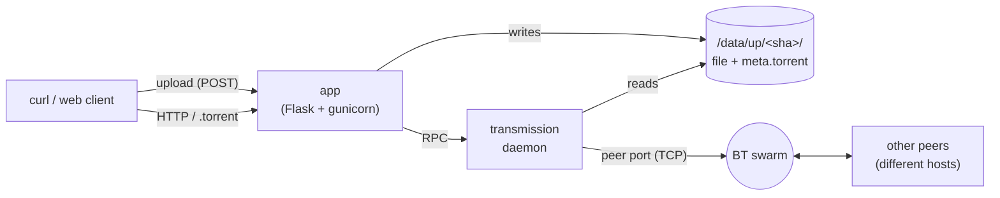

# 0bt

A no-bullshit file host that hands you back **both an HTTP URL and a BitTorrent magnet** for every upload.

Inspired by [0x0.st](https://0x0.st) (upstream at [git.0x0.st/mia/0x0](https://git.0x0.st/mia/0x0)). The earlier 0bt — which first extended a 0x0-style host with BitTorrent — was [audiodude/0bt (legacy branch)](../../tree/legacy). This codebase is a 2026 clean-room rewrite of the same idea, sharing no code with either, and is not a GitHub fork.

The rewrite focuses on:
- One-command deploy: `docker compose up -d`
- Modern Python 3.12 / Flask 3 / SQLAlchemy 2 stack
- Streaming uploads up to 1.5 GiB (configurable) without spilling into RAM
- Auto-generated `.torrent` files seeded by an in-cluster Transmission daemon
- An in-app HTTP tracker (`/announce` + `/scrape`) — low-latency local peer discovery alongside public trackers + DHT

## Quick start (local)

```bash
cp .env.example .env
# Edit .env — at minimum, change TRANSMISSION_RPC_PASSWORD.
docker compose up -d --build
curl -F "file=@somefile.bin" http://localhost:8080
```

The response is three lines:

1. The HTTP download URL
2. The `.torrent` URL
3. The magnet URI

```
http://localhost:8080/AbCdEf.bin
http://localhost:8080/AbCdEf.torrent
magnet:?xt=urn:btih:...&dn=somefile.bin&tr=...
```

Pass any of those to a BitTorrent client (Transmission, qBittorrent, etc.) and it joins the swarm. The first peer is the in-cluster Transmission instance.

## Production deploy (TLS, your domain)

For a real deployment you almost certainly want a public IP, your own domain, and TLS:

```bash
# In .env
FHOST_BASE_URL=https://files.example.com
CADDY_DOMAIN=files.example.com
CADDY_ADMIN_EMAIL=you@example.com

# Bring up the full stack
docker compose --profile caddy up -d --build
```

Caddy auto-issues a Let's Encrypt cert and reverse-proxies the app. Open ports `80`, `443`, and `51413` (TCP+UDP) on your firewall.

The recommended hosting target is a small VPS with generous bundled egress (egress is the dominant cost for any file host). See [`docs/deploy-hetzner.md`](./docs/deploy-hetzner.md) for an end-to-end walkthrough on Hetzner Cloud CX22 (~€5/mo, 20 TB included).

## Configuration

See [`.env.example`](./.env.example) for the full list. Highlights:

| Variable                     | Default                                | Notes                                   |
|-----------------------------|----------------------------------------|-----------------------------------------|
| `FHOST_BASE_URL`            | `http://localhost:8080`                | Public URL; baked into magnets.         |
| `FHOST_MAX_CONTENT_LENGTH`  | `1610612736` (1.5 GiB)                 | Max upload size in bytes.               |
| `FHOST_TRACKERS`            | several public trackers                | Embedded in every magnet.               |
| `FHOST_INTERNAL_TRACKER`    | `""`                                   | Optional self-hosted tracker URL.       |
| `BT_PEER_PORT`              | `51413`                                | Host port mapped to transmission.       |
| `TRANSMISSION_RPC_PASSWORD` | `change-me-or-die`                     | **Change this.**                        |
| `CADDY_DOMAIN`              | unset                                  | Required when using `--profile caddy`.  |

## Architecture



- **app** streams uploads to `/data/up`, hashes them, dedups, generates the `.torrent`, then asks Transmission to seed.
- **transmission** seeds files from the same volume; listens for peer connections on `BT_PEER_PORT`.
- **caddy** (optional profile) terminates TLS and reverse-proxies `/`.
- **`/announce` and `/scrape`** are served by the app itself (see [`app/tracker.py`](./app/tracker.py)) and prepended to every magnet, alongside public trackers and DHT.

## Tests

```bash
python3 -m venv .venv && .venv/bin/pip install -e '.[dev]'
.venv/bin/pytest          # unit tests
scripts/acceptance.sh     # uploads + downloads various sizes against a running stack
scripts/swarm-test.sh     # cross-host BitTorrent swarm via a self-hosted opentracker
```

## License

Inherits the EUPL-1.2 license from upstream 0x0.
