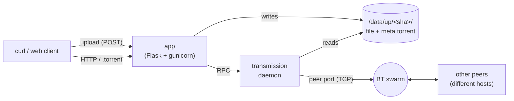

# 0bt

A no-bullshit file host that hands you back **both an HTTP URL and a BitTorrent magnet** for every upload.

Inspired by [0x0.st](https://0x0.st) (upstream at [git.0x0.st/mia/0x0](https://git.0x0.st/mia/0x0)). The earlier 0bt — which first extended a 0x0-style host with BitTorrent — was [audiodude/0bt (legacy branch)](../../tree/legacy). This codebase is a 2026 clean-room rewrite of the same idea, sharing no code with either, and is not a GitHub fork.

The rewrite focuses on:
- One-command local deploy: `docker compose up -d`
- Modern Python 3.12 / Flask 3 / SQLAlchemy 2 stack
- Streaming uploads up to 1.5 GiB (configurable) without spilling into RAM
- Auto-generated `.torrent` files seeded by an in-cluster Transmission daemon
- Cross-host BitTorrent swarming via public trackers + DHT (with optional self-hosted tracker)
- Deployable to Railway (multi-service)

## Quick start (local)

```bash
cp .env.example .env
# Edit .env — at minimum, change TRANSMISSION_RPC_PASSWORD.
docker compose up -d --build
curl -F "file=@somefile.bin" http://localhost:8080
```

The response is three lines:

1. The HTTP download URL
2. The `.torrent` URL
3. The magnet URI

```
http://localhost:8080/AbCdEf.bin
http://localhost:8080/AbCdEf.torrent
magnet:?xt=urn:btih:...&dn=somefile.bin&tr=...
```

Pass any of those to a BitTorrent client (transmission, qBittorrent, etc.) and it will join the swarm. The first peer is the in-cluster Transmission instance.

## With TLS (Caddy profile)

```bash
CADDY_DOMAIN=files.example.com docker compose --profile caddy up -d --build
```

Caddy will auto-issue a Let's Encrypt cert and serve the app on HTTPS. Set `FHOST_BASE_URL=https://files.example.com` so generated magnets and torrent URLs point at the right place.

## Configuration

See [`.env.example`](./.env.example) for the full list. Highlights:

| Variable                     | Default                                | Notes                                   |
|-----------------------------|----------------------------------------|-----------------------------------------|
| `FHOST_BASE_URL`            | `http://localhost:8080`                | Public URL; baked into magnets.         |
| `FHOST_MAX_CONTENT_LENGTH`  | `1610612736` (1.5 GiB)                 | Max upload size in bytes.               |
| `FHOST_TRACKERS`            | several public trackers                | Embedded in every magnet.               |
| `FHOST_INTERNAL_TRACKER`    | `""`                                   | Optional self-hosted tracker URL.       |
| `TRANSMISSION_RPC_PASSWORD` | `change-me-or-die`                     | **Change this.**                        |
| `FHOST_USE_X_ACCEL_REDIRECT`| `0`                                    | `1` for nginx-style accel.              |

## Architecture



- **app** streams uploads to `/data/up`, hashes them, dedups, generates the `.torrent`, then asks Transmission to seed.
- **transmission** seeds files from the same volume.
- Magnets contain public trackers + DHT + a `webseed` (BEP-19) pointing at the HTTP URL, so peers can mix BT and HTTP.

## Deploy to Railway

The compose stack assumes shared volumes between the app and Transmission containers, which Railway doesn't support (one volume per service). For Railway, the bundled `Dockerfile.railway` packages everything (Flask app + transmission-daemon + a small socat bridge) under supervisord in a single image, attached to one volume.

There's an automated deploy at [`scripts/railway-deploy.py`](./scripts/railway-deploy.py):

```bash
export RAILWAY_TOKEN=...
python3 scripts/railway-deploy.py \
    --project-id <PROJECT_UUID> \
    --env-id <ENVIRONMENT_UUID> \
    --repo audiodude/0bt \
    --branch rewrite-2026
```

The script (idempotently):
1. Creates the `app` service from this repo + branch.
2. Creates a 5-GiB volume mounted at `/data`.
3. Allocates a `*.up.railway.app` HTTP domain and points `FHOST_BASE_URL` at it.
4. Allocates a TCP proxy for the BT peer port and sets `BT_PEER_PORT`,
   `BT_BRIDGE_FROM`, `BT_PUBLIC_HOST`, `BT_ANNOUNCE_PORT` so transmission
   announces (and listens on) the externally-reachable port.
5. Triggers a redeploy.

### How peers discover the deployed seeder

External BT trackers (opentracker included) and DHT both record the *source IP* of an announce, which behind a TCP proxy is the platform's egress address — unreachable inbound. To work around this, **the app runs its own HTTP tracker at `/announce`** (see [`app/tracker.py`](./app/tracker.py)). It's the first `tr=` entry in every magnet, and it serves the deployed seeder's public host:port (taken from `BT_PUBLIC_HOST` / `BT_PUBLIC_PORT`) as a peer for any info_hash the app owns. Hostnames are passed through *unresolved* so peers resolve them from their own (public-internet) DNS view rather than the platform's internal one. [`scripts/swarm-test-railway.sh`](./scripts/swarm-test-railway.sh) verifies this end-to-end without using `connect_peer` hints.

Public trackers and DHT remain in the magnet for swarm fan-out once any peer is reachable; the in-app tracker is what makes the deployed instance discoverable in the first place.

## License

Inherits the EUPL-1.2 license from upstream 0x0.
